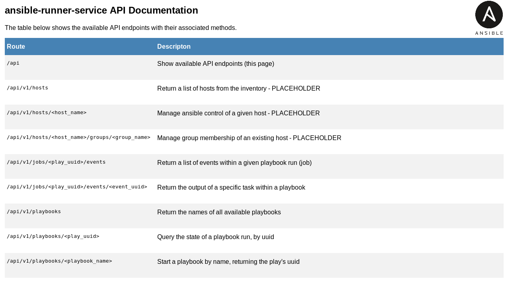

# ansible-runner-service
This is a POC project which wraps the ansible_runner interface inside a REST API.  

The incentive for this is two-fold;
- provide Ansible integration to non-python projects
- provide a means of programmatically running playbooks where the ansible engine is running on a separate host or in a separate container

## Installation
Try before you buy...simply unzip the archive and run :)
```
python ansible-runner-service.py
```
This is 'dev' mode - all files and paths are relative to the path that you've
unzipped the project into.

For 'prod' mode, a setup.py is provided. Once the package is installed, and
called from /usr/bin the script will expect config and output files to be
found in all normal locations (see proposed file layout below)  
```
sudo python setup.py install --record installed_files --single-version-externally-managed
```

Once this is installed, you may start the service with
```
ansible-runner-service
```
Word of warning though - 'prod' mode is less tested!

## API Endpoints

Once the service is running, you can point your browser at  ```http://localhost:5001/api``` to show which endpoints are available. Each endpoint is described along with a curl example showing invocation and output.  



You may click on any row to expand the description of the API route and show the curl example.  

**Note**: *It is not the intent of this API to validate the parameters passed to it. It is assumed that parameter selection and validation happen prior to the API call.*  

## Testing
The only testing to date is purely functional, using a test playbook (test.yml). I fully expect to changes to support 'real' playbooks.  

### Manual Testing
The archive contains a simple playbook that just uses the bash sleep command, so the API can be quickly checked.  

Use the steps below (dev mode), to quickly exercise the API  
1. Get the list of available playbooks (should just be test.yml)  
```curl -i http://localhost:5001/api/v1/playbooks  -X GET```
2. Run the test.yml playbook, passing the time_delay parameter (30 secs should be enough).  
```curl -i http://localhost:5001/api/v1/playbooks/test.yml -d "time_delay=30" -X POST``  
3. The previous command will return the playbooks UUID. Use this identifier to query the state or progress of the run.  
```curl -i http://localhost:5001/api/v1/playbooks/f39069aa-9f3d-11e8-852f-c85b7671906d -X GET```
4. Get a list of all the events in a playbook. The return list consists of all the job event ID's
```curl -i http://localhost:5001/api/v1/jobs/f39069aa-9f3d-11e8-852f-c85b7671906d/events  -X GET```
5. To get specific output from a job event, you can query the job event  
```curl -i http://localhost:5001/api/v1/jobs/f39069aa-9f3d-11e8-852f-c85b7671906d/events/13-c85b7671-906d-e52d-d421-000000000008  -X GET```  

Obviously you'll need to change the play and job uuids for your run :)

### Regression Testing
TODO  

## File Layout (Proposed)

/etc/ansible-runner-service  
    logging.yaml  
    config.yaml

/usr/share/ansible-runner-service  
    artifacts  
    inventory  
    env  
    project  
        test.yaml  
    roles

/var/log/ansible-runner-service.log  

/usr/share/doc/ansible-runner-service  
    README.md  
    LICENSE.md  

/etc/systemd/system  
    ansible-runner-service.service  

/usr/bin/  
    ansible-runner-service  
